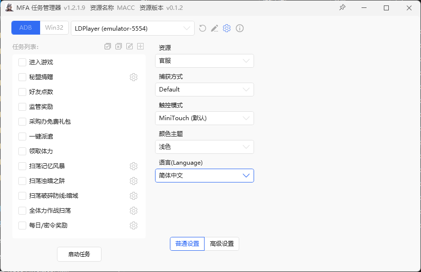
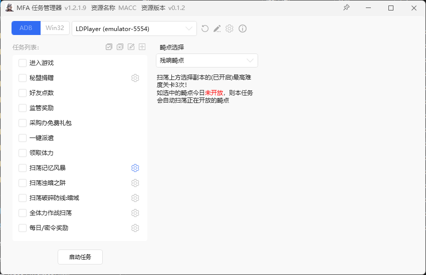

<!-- markdownlint-disable MD033 MD041 -->
<p align="center">
  
</p>

<div align="center">

# MACC

**MAA x MBCC**  
又可为 **Minos Assistant of Crisis Control**(米诺斯危机管理助手)  
基于全新架构的 无期迷途 小助手。图像技术 + 模拟控制，解放双手！  
由 [MaaFramework](https://github.com/MaaXYZ/MaaFramework) 强力驱动！
</div>

## 碎碎念

- 借国服UI改版之际，基于MAA重构编写了之前自用的无期迷途每日自动化脚本（autohotkey）
- ***<span style="font-size:15px;">作者主玩繁中国际服,本次为借号编写，测试功能和情景有限（比如没有测试新UI皮肤）如遇到bug欢迎带日志和截图提交issue~ </span>***
- 国际服更新UI后会更新繁中版，其他语言暂无支持计划
- 随缘维护/升级功能，咕咕。。。

## 功能介绍

目前已有的功能：

- 启动游戏:<br>消除广告/领取邮件/禁闭者情绪检测及奖励领取
- 秘盟捐赠
- 好友点数
- 监管奖励
- 领取免费礼包
- 一键派遣
- 领取体力
- 扫荡作战:<br> 记忆风暴/浊暗之阱/暗域/淘金狂热/恶兆之种/禁区探查/帕尔马废墟
- 领取监察密令奖励

## 使用说明

下载地址：<https://github.com/mxia9416/MACC/releases>

### Windows

- 对于绝大部分用户，请下载 `MACC-win-x86_64-vXXX.zip`
- 若确定自己的电脑是 arm 架构，请下载 `MACC-win-aarch64-vXXX.zip`  
  _请注意！Windows 的电脑几乎全都是 x86_64 的，可能占 99.999%，除非你非常确定自己是 arm，否则别下这个！_
- 解压后运行 `MFAWPF.exe`（图形化界面，推荐使用）或 `MaaPiCli.exe`（命令行）即可

### macOS

- 若使用 Intel 处理器，请下载 `MACC-macos-x86_64-vXXX.zip`
- 若使用 M1, M2 等 arm 处理器，请下载 `MACC-macos-aarch64-vXXX.zip`
- 使用方式：

  ```bash
  chmod a+x MaaPiCli
  ./MaaPiCli
  ```

### Linux

~~用 Linux 的大佬应该不需要我教~~

## 图形化界面

- <span style="font-size:25px;">[MFAWPF](https://github.com/SweetSmellFox/MFAWPF)</span>  
- 由社区大佬[SweetSmellFox](https://github.com/SweetSmellFox)编写的基于WPF的GUI,通过内置的MAAframework来直接控制任务流程  
- 打开本程序和模拟器后，先在上方选择要控制的模拟器  
- 勾选想要执行的任务后**启动任务**，任务会顺序执行，***进入游戏***会启动游戏程序，其他任务需要游戏为开启状态  
- 点击部分任务右方的设置，可以配置任务属性和查看任务帮助



## 注意事项

- 提示“应用程序错误”，一般是缺少运行库，请安装一下 [vc_redist](https://aka.ms/vs/17/release/vc_redist.x64.exe)
- 添加 `-d` 参数可跳过交互直接运行任务，如 `./MaaPiCli.exe -d`
- MAA framework 2.0 版本已支持 mumu 后台保活，会在 run task 时获取 mumu 最前台的 tab
- 基于雷电模拟器9，1920*1080（280DPI）平板版开发，其它模拟器或分辨率如遇到问题，可首先尝试上述配置
- 因MAA基于720p开发图像识别，1280*720(240DPI)理论上有最强适配性，如1080p遇到问题，可换720p尝试
- 反馈问题请附上日志文件 `debug/maa.log`以及问题界面的截图，谢谢！

## How to build

**如果你要编译源码才看这节，否则直接 [下载](https://github.com/mxia9416/MACC/releases) 即可**

0. 完整克隆本项目及子项目

    ```bash
    git clone --recursive https://github.com/mxia9416/MACC.git
    ```

1. 下载 MaaFramework 的 [Release 包](https://github.com/MaaXYZ/MaaFramework/releases)，解压到 `deps` 文件夹中
2. 安装

    ```python
    python ./install.py
    ```

生成的二进制及相关资源文件在 `install` 目录下

## 开发相关

- [MaaFW 开发思路](https://github.com/MaaXYZ/MaaFramework/blob/main/docs/zh_cn/1.1-%E5%BF%AB%E9%80%9F%E5%BC%80%E5%A7%8B.md#%E5%BC%80%E5%8F%91%E6%80%9D%E8%B7%AF)  
  MACC 目前使用其中第一种方式（纯 Pipeline 低代码）
- [Pipeline 流水线协议](https://github.com/MaaXYZ/MaaFramework/blob/main/docs/zh_cn/3.1-%E4%BB%BB%E5%8A%A1%E6%B5%81%E6%B0%B4%E7%BA%BF%E5%8D%8F%E8%AE%AE.md)

更多文档请前往 [MaaFramework](https://github.com/MaaXYZ/MaaFramework) 主仓库查看

## 鸣谢

本项目由 **[MaaFramework](https://github.com/MaaXYZ/MaaFramework)** 强力驱动！ 
